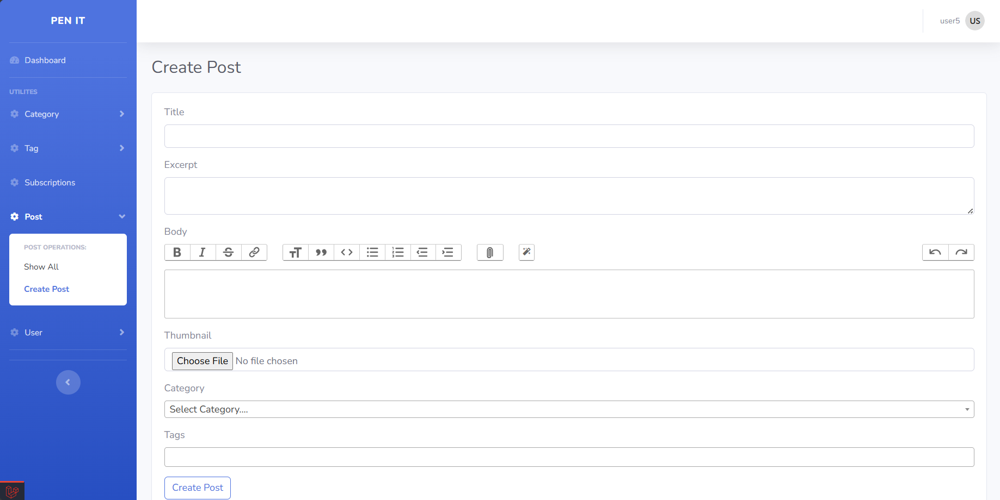

<h1 style="display: flex; align-items: center; justify-content: center;">

    Pen-It 
</h1>

## About Pen-It
<p>Pen-It is a full-stack, feature-rich blog management system designed for admins, authors, and readers. Built using the MVC architecture, it ensures scalability, maintainability, and ease of use.</p>

## Features:

### Core Features:
- ___Secure Authentication___: <br>Ensures reliable access control for users.

- ___Admin Tools___: <br>Efficient user and content management with category and tag creation.
  
- ___Stripe Integration___: <br>Enables subscription-based access to premium features such as AI-powered article generation.

- ___Analytics for Authors___: <br>Provides detailed insights like total views, most engaging posts, and AI-generated article tracking.

- ___AI powered assistance___: <br>With the help of AI, the author can generate the body of the blog.
  
- ___Public Interface___: <br>Intuitive UI supporting browsing, commenting, and advanced search filters by categories, tags, or authors.

- ___Newsletter System___: <br>Engages users with timely updates on trending posts and new content.

### Technical Implementations:

- Built using the MVC architecture to maintain separation of concerns.

- Policies for role-based access control and resource management.

- Uses Schedulers and queues for seamless asynchronous email notifications without needing to wait for the subscribers to receive the notification.
  
- Observer Pattern to automate repetitive tasks like updating analytics and sending notifications.

- Chain Of Responsibility Pattern to manage and validate the user's request.

- Global Context to manage shared data and states across the application.

- Secured the app with CSRF Protection for robust security against malicious attacks.

## Installation

### Prerequisites:

- PHP 8.0+
- Laravel
- Composer
- MySQL
- NPM

### Steps to setup:

1. Clone the repository

```bash
    git clone https://github.com/Mani-G21/blog-cms
```

2. Remove the `.git` file
 
3. Install the dependancies

```bash
    composer install
    npm install
```

4. configure the `.env` file with the help of `.env.example`

5. Run database migrations

```bash
    php artisan migrate
```
6. Start the development server

```bash
    php artisan serve
```

7. Start the front-end server for auth

```bash
    npm run dev
```

8. Start the Queue in order to listen for any jobs

```bash
    php artisan queue:work
```

## Usage

### Admin Role
- Manage users, categories, tags, and blogs.
  
### Author Role
- Write and publish blog posts.
- View post performance via analytics.
- Subscriber for premium features to generate blog posts with AI-Powered Assistance

### Reader Role
- Explore blogs, authors, comment on posts, and subscribe for newsletters.

## Overview of the folder structure:
- `app/Helpers/` <br>Helper functions.
  
- `app/Http/Controllers`<br> To implement the business logic and to return the views.

- `app/Jobs/`<br>Jobs to send the email notifications
- `app/Models/` <br>Models to communicate with the database
- `app/Observers/`<br>To observe on the changes being made to the database and take suitable actions on it.
- `app/policies/`: <br>To implement access on the models based on the role of the user.
- `database/`<br> To provide the seeders, factories and migrations for the database tables.
- `resources/views/` <br>To provide the UI for the frontend.
- `routes/`<br> Provides routes for navigation
- `storage/app/public/` <br>Provides the assets for the blogs or to store the assets in the project ___(A softlink points to this directory for accessing these assets with the help of public url)___.

## Screenshots

### Home page


### Author details


### Blog Hero Section


### Blog Details


### Reader comments


### Registration


### Dashboard


### Subscription Plans


### Creating a post


### User Management


### Categories Management


### Tags Management


### Posts Management

